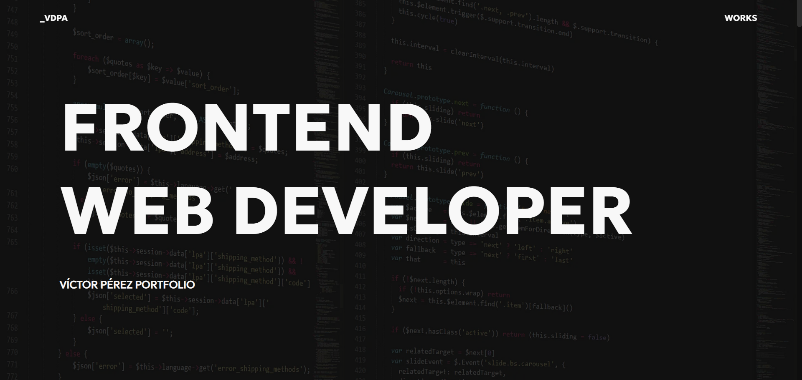
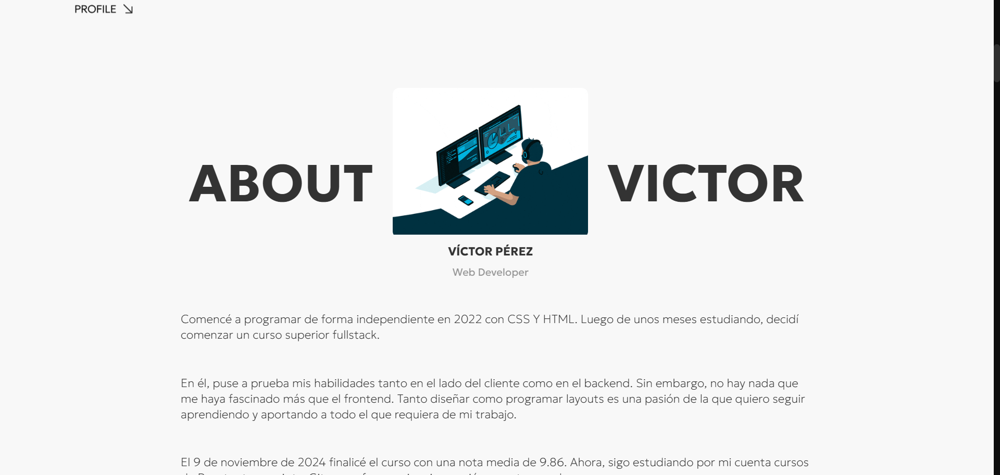
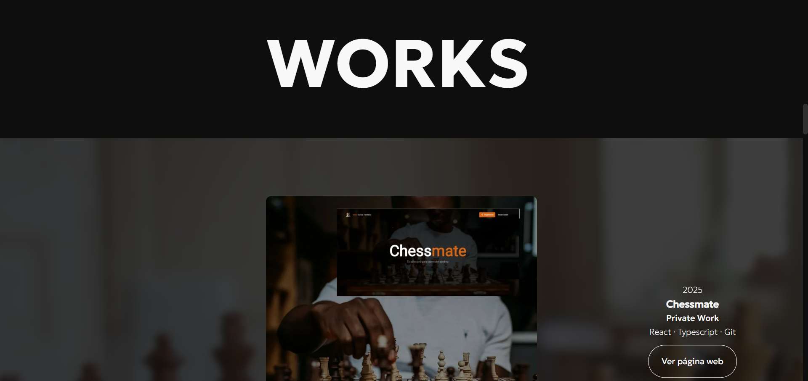
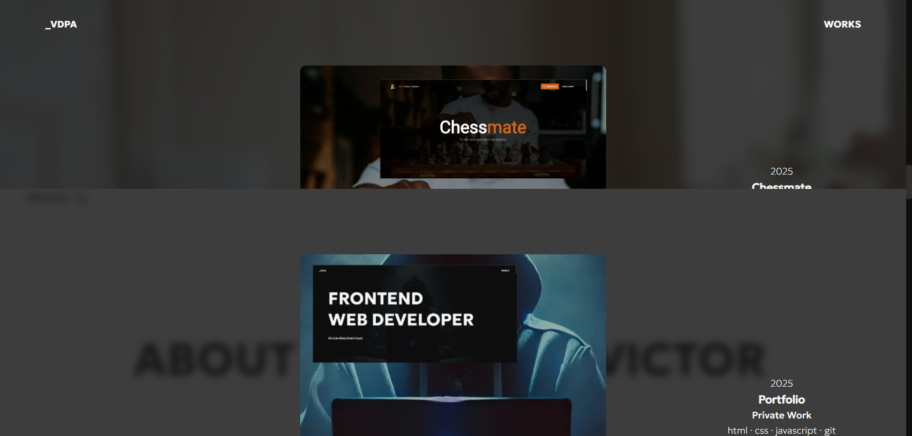
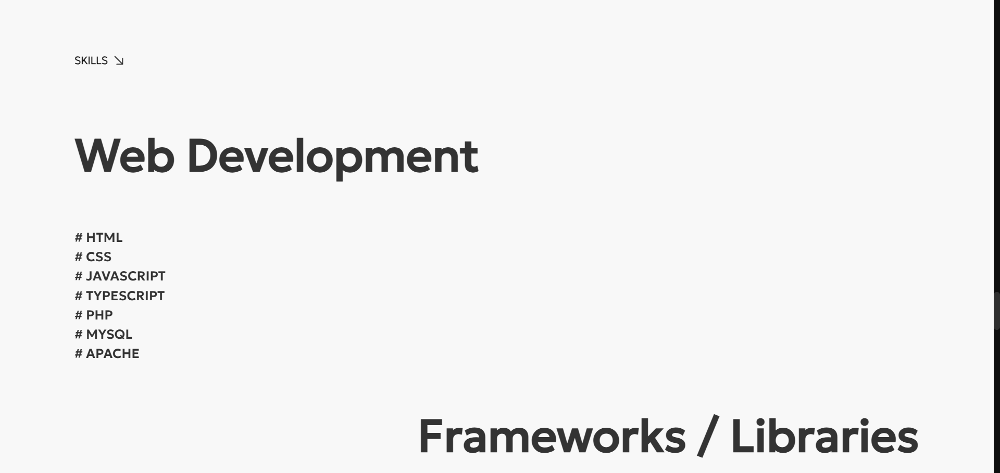
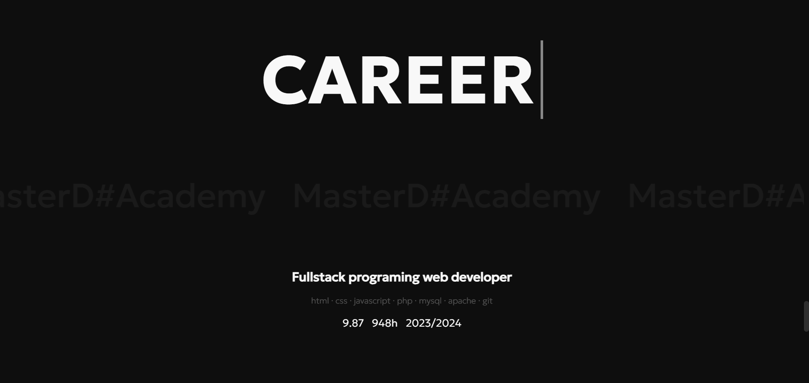

# Portfolio web - Víctor Pérez - Desarrollador Frontend

## 👋 Hola

Soy un **desarrollador frontend apasionado** por crear experiencias web modernas, rápidas y visualmente atractivas. Me encanta transformar diseños en **interfaces interactivas y responsive**, siempre cuidando la **usabilidad** y el **detalle en cada proyecto**.

En mi portfolio encontrarás **proyectos reales** construidos con tecnologías modernas como **React, TypeScript, Vite, CSS Modules y más**, donde también he incorporado herramientas de **IA como copiloto** para optimizar flujos y generar ideas innovadoras.

💡 Mi objetivo: combinar **diseño y desarrollo** para crear aplicaciones web que sean tanto **funcionales** como **impactantes visualmente**, y que ofrezcan experiencias únicas a los usuarios.



---

## Tabla de Contenidos 🧭

-   [Demo](#demo)
-   [Características](#características)
-   [Instalación](#instalación)
-   [Uso](#uso)
-   [Estructura del proyecto](#estructura-del-proyecto)
-   [Tecnologías utilizadas](#tecnologías-utilizadas)
-   [Licencia](#licencia)
-   [Contacto](#contacto)

---

## Demo 🚀

-   Live: https://tortoise-code-z.github.io/portfolio/
-   Imágenes del proyecto:  
      
    
    
    
    
    

---

## Características ✨

-   **Diseño 100% responsive**: Se adapta perfectamente a móviles, tablets y escritorio, ofreciendo una experiencia consistente en todos los dispositivos.
-   **Frontend puro**: Desarrollado con **JavaScript, HTML y CSS** sin frameworks, garantizando velocidad y control total sobre el código.
-   **Interactividad fluida**: Animaciones y transiciones suaves para mejorar la experiencia del usuario.
-   **Optimización de rendimiento**: Código ligero y carga rápida gracias a la simplicidad del stack.
-   **Estructura clara y modular**: HTML semántico y CSS organizado para facilitar mantenimiento y escalabilidad.
-   **UI atractiva y sencilla**: Diseño intuitivo que facilita la navegación y el acceso a la información más relevante.

---

## Instalación 🛠️

### Prerrequisitos

-   **Node.js** (versión 18 o superior) — necesario para ejecutar el proyecto y las dependencias de npm.
-   **npm** — gestor de paquetes para instalar dependencias.
-   **Vite** — herramienta de build moderna utilizada para el proyecto (se instala automáticamente con `npm install`).
-   **Git** — si van a clonar el repositorio.

### Pasos de instalación

```bash
# Clonar el repositorio
git clone https://github.com/Tortoise-code-Z/portfolio

# Entrar en el directorio
cd portfolio

# Instalar dependencias
npm install
```

---

## Uso 💻

```bash
# Ejecutar el servidor de desarrollo
npm run dev

```

-   Acceder a: [http://localhost:XXXX](#)

---

## Estructura del proyecto 📁

```plaintext
Portfolio/
│
├── public/
├── src/
│   ├── assets/
|       ├── fonts
|       └── images
│   ├── consts/
│   ├── css/
│   ├── js/
|       ├── components
|       ├── templates
|       ├── utils
|       └── index.js
├── index.html
├── package.json
└── README.md
```

---

## Tecnologías utilizadas 🧰

**Diseño:**

**Lenguajes y herramientas principales:**

-   **HTML5** — estructura semántica de la web y accesibilidad.
-   **CSS3** — estilos y diseño responsive, incluyendo transiciones y animaciones.
-   **JavaScript (vanilla)** — lógica del frontend, interactividad.

**Optimización y buenas prácticas:**

-   **CSS modular y organizado** — facilita mantenimiento y escalabilidad del proyecto.
-   **JavaScript limpio y modular** — funciones y scripts estructurados para rendimiento y legibilidad.

**Desarrollo y control de versiones:**

-   **Git** — control de versiones del proyecto.
-   **GitHub** — repositorio remoto público y gestión de código.

**Diseño y UX/UI:**

-   **Figma** — diseño del layout, prototipos y wireframes antes de la implementación.

---

## Contacto 📬

Si quieres ponerte en contacto conmigo, colaborar en proyectos o simplemente comentar algo sobre mi trabajo, puedes hacerlo a través de las siguientes vías:

-   **Portfolio:** [https://tortoise-code-z.github.io/portfolio/](https://tortoise-code-z.github.io/portfolio/)
-   **Email:** victorperez.brmte@passmail.com
-   **LinkedIn:** [www.linkedin.com/in/víctor-pérez-developer](www.linkedin.com/in/víctor-pérez-developer)
-   **GitHub:** [https://github.com/Tortoise-code-Z](https://github.com/Tortoise-code-Z)

💡 Siempre estoy abierto a nuevas oportunidades y colaboraciones, ¡no dudes en escribirme!
